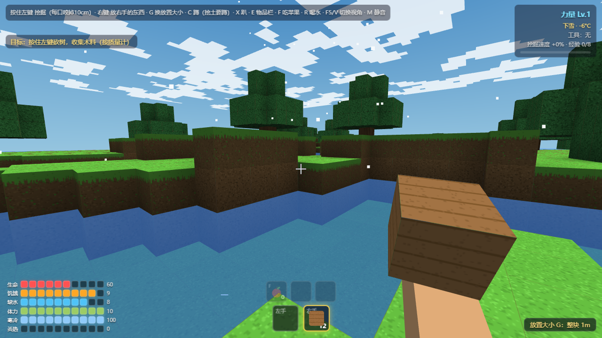
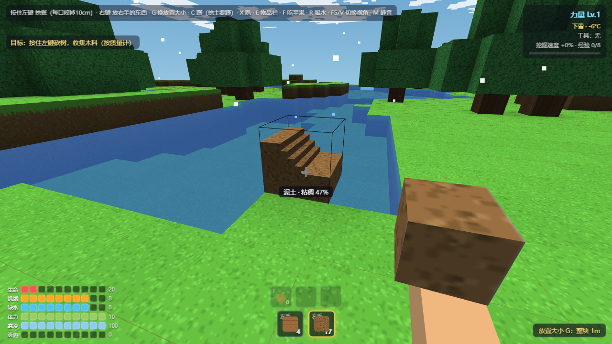

# 方块生存 (Block Survival)

一个**纯单文件**的网页版第一人称体素沙盒生存游戏。不联网、不安装、不用构建 —— 把两个文件放一起，双击就能玩。



## 它和别的 Minecraft 类游戏有什么不一样

- **⛏️ 10cm 微型雕刻挖掘** —— 每挖一下只咬掉一个 10cm 的子格，不是整块消失。你可以挖出任意形状的坑、槽、隧道，视线能穿过挖空的洞继续往深处挖。


- **⚖️ 材料按质量（kg）计算** —— 每种材料有密度，挖出来的东西按 kg 计量（小数点后 4 位），放置消耗对应质量，全程质量守恒。
- **🧱 粘稠度与重力塌方** —— 每种材料的粘稠度在一个区间内逐块随机：树叶几乎不相连、石头连成整体。挖掉支撑后，悬空的方块会真的塌下来 —— 砸到你还会扣血。
- **✋ 没有背包** —— 你只有一双手：左手、右手各拿一摞方块。挖到的整块先拿在手里，手满了散成材料；背包是留给未来制作的。
- **🌦️ 天气与体温** —— 7 种天气各有温度（晴朗 26°C 到下雪 -6°C、热浪 38°C），雨雪会改变天色和雾；离舒适温区太远会积累寒冷/炎热值，涨满了冻伤或中暑。
- **🏃 体力与动量** —— 疾跑要慢慢加速、耗体力，跑太快的时候突然按侧移会把自己绊倒。
- **🧍 姿态系统** —— 站立 / 蹲下 / 趴下；挖脚下的松土必须蹲下来挖。
- **🛠️ 合成链** —— 砍树 → 木料 → 木板 → 工具箱 → 木镐/石镐，挖掘有经验等级成长。
- **🌅 细节** —— 雕刻面逐格环境光遮蔽、洞越深越暗、方块颜色抖动、第三人称角色（F5/V 切换）、受击与摔伤全程刚体判定。

## 操作

| 按键 | 功能 |
| --- | --- |
| `W` `A` `S` `D` | 移动（正面最快，侧面最慢） |
| `Shift` | 疾跑（渐加速，耗体力） |
| `空格` | 跳跃 |
| 鼠标左键（按住） | 挖掘 —— 每口咬掉 10cm |
| 鼠标右键 | 放置右手拿的方块 |
| `G` | 切换放置尺寸：1m → 50cm → 25cm → 10cm |
| `C` / `X` | 蹲下 / 趴下（挖脚边的土要蹲下） |
| `E` | 物品栏（合成、材料袋、双手管理） |
| `F` / `R` | 吃苹果 / 喝水 |
| `F5` 或 `V` | 第一/第三人称切换 |
| `M` | 静音 |

## 运行

方式一：直接双击 `方块生存.html`（前提：`three.min.js` 和它在同一个文件夹）。

方式二（推荐，本地服务器）：

```bash
python -m http.server 8137
# 打开 http://127.0.0.1:8137/方块生存.html
```

## 技术

- 整个游戏就是**一个 HTML 文件**（约 2500 行，按模块分节中文注释：配置 / 地形 / 物理 / 雕刻 / 交互 / UI），想改数值直接改文件顶部的配置区。
- 渲染用 [Three.js r128](https://github.com/mrdoob/three.js)（MIT 协议），已本地化为 `three.min.js`，不依赖任何 CDN。
- 无框架、无构建步骤、无网络请求。体素世界 128×128×40，16×16 分块渲染 + 只画暴露面；10cm 雕刻用 1000 子格位图 + 贪心合并网格。

## 目录结构

```
├── 方块生存.html   # 游戏本体（全部逻辑都在这一个文件里）
├── three.min.js    # Three.js r128 本地库
├── docs/           # 截图
├── LICENSE         # MIT
└── README.md
```

## 协议

[MIT](LICENSE) © 2026 aorucshiea
